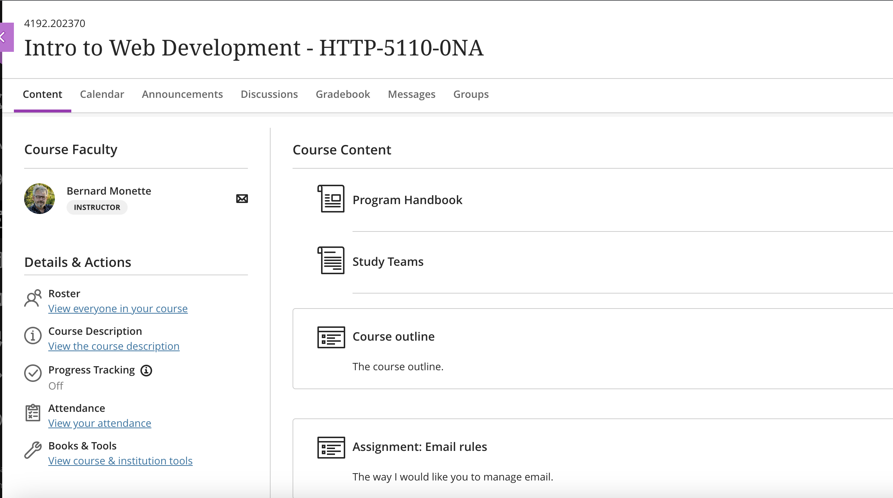

# http5110
Created a repo to store files from http5110

This is the Introduction to Web Development.

## Course Outline
<https://learn.humber.ca/ultra/courses/_233701_1/outline>

## Info
This the Introduction to Web development and the subject code is http5110. The instructor is Bernard Monette.
